# Topographic Maps of Planets and Moons

[](https://www.gnu.org/licenses/gpl-3.0)
[](https://twitter.com/eleanor_lutz)
[](https://github.com/eleanorlutz)

This repository explains how to make topographic maps of planets and moons using open-source data from the [USGS](https://www.usgs.gov/centers/astrogeo-sc/data-tools), [IAU](https://planetarynames.wr.usgs.gov/), and [NASA](https://solarsystem.nasa.gov/). Software used includes `Python 3.7.1`, `GDAL 2.4.1`, `Illustrator CC 2019` and `Photoshop CC 2019`. If you have comments or suggestions for this tutorial, please let me know [on my blog](http://tabletopwhale.com/2019/06/17/a-topographic-map-of-mercury.html)! You can also buy these topographic maps for [Mars](https://www.redbubble.com/people/eleanorlutz/works/39425769), [Venus](https://www.redbubble.com/people/eleanorlutz/works/39425752), [Mercury](https://www.redbubble.com/people/eleanorlutz/works/39425767), and [the Moon](https://www.redbubble.com/people/eleanorlutz/works/39425758).

**Python dependencies:** `matplotlib` `numpy` `pandas` `os` `cartopy` `json` `osgeo` `math` `scipy`

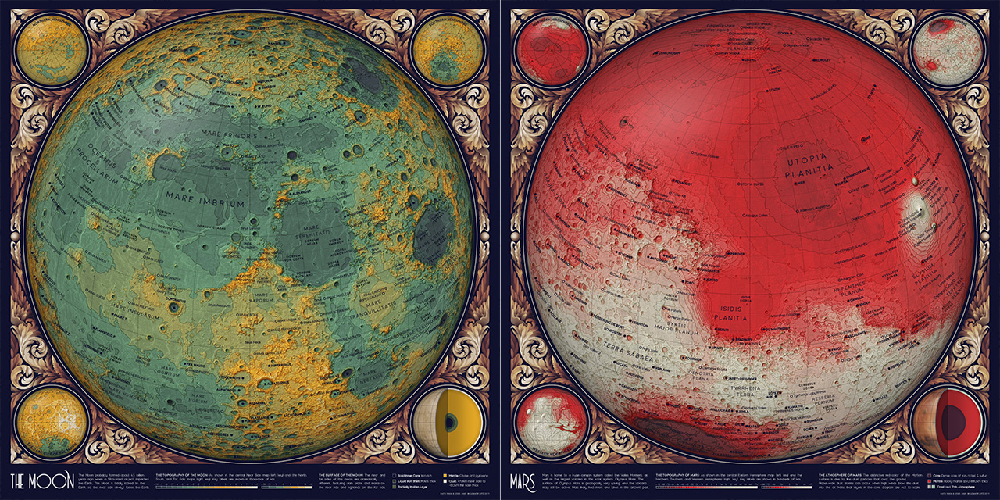

## Special instructions for beginners

##### If you're new to coding:

[Software Carpentry](https://software-carpentry.org/) has great tutorials for [installing Python](https://carpentries.github.io/workshop-template/) (scroll down and follow the directions in  the Bash Shell and Python sections), [getting starting with Jupyter Notebooks](http://swcarpentry.github.io/python-novice-inflammation/setup/index.html), and [beginner-friendly Python programming](http://swcarpentry.github.io/python-novice-inflammation/aio/index.html). After you've installed Python using these tutorials, you can use [Git Desktop](https://desktop.github.com/) and the instructions in [this tutorial](https://help.github.com/en/desktop/contributing-to-projects/cloning-a-repository-from-github-desktop) to download the code and data in this tutorial. For the code in this repository you will also need to install [GDAL](https://gdal.org/download.html). The [installation instructions](https://gdal.org/download.html) in the *Conda* section are probably the most relevant if you've installed Python as described above.

##### If you're new to design:

You'll need software for editing raster and vector images ([this article](https://vector-conversions.com/vectorizing/raster_vs_vector.html) explains the difference). I use [Adobe Photoshop](https://www.adobe.com/products/photoshop.html) and [Illustrator](https://www.adobe.com/products/illustrator.html), but you can also use the free open-source programs [Gimp](https://www.gimp.org/downloads/) and [Inkscape](https://inkscape.org/release/inkscape-0.92.4/). There is no perfect software that fits everyone's needs, so you'll want to understand the pros and cons for the different [raster](https://www.colorexpertsbd.com/blog/brief-comparison-photoshop-gimp) and [vector](https://logosbynick.com/inkscape-vs-illustrator-vs-coreldraw/) programs before choosing.

## Table of Contents

1. [Gathering and processing data](#data)
2. [Map design in Python](#python)
3. [Map design in Illustrator and Photoshop](#illustrator_photoshop)
4. [References](#references)
5. [License](#license)

<a name="data"/>

## Gathering and processing data

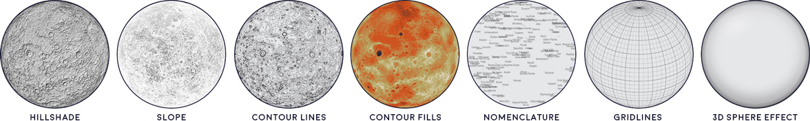

#### Digital Elevation Models
Digital Elevation Models (DEMs) are data files that provide height information. For this project I'm using the United States Geologic Survey's DEMs for [Mars](https://astrogeology.usgs.gov/search/map/Mars/Topography/HRSC_MOLA_Blend/Mars_HRSC_MOLA_BlendDEM_Global_200mp_v2), [Mercury](https://astrogeology.usgs.gov/search/map/Mercury/Topography/MESSENGER/Mercury_Messenger_USGS_DEM_Global_665m_v2), [Venus](https://astrogeology.usgs.gov/search/map/Venus/Magellan/RadarProperties/Venus_Magellan_Topography_Global_4641m), and the [Earth's Moon](https://astrogeology.usgs.gov/search/details/Moon/LRO/LOLA/Lunar_LRO_LOLA_Global_LDEM_118m_Mar2014/cub). Each pixel in these `GeoTIFF` files describes the elevation at that specific location on the planet. `GeoTIFF` files also have embedded geographic data that allows tools like `GDAL` to correctly position the elevation data onto a globe.

To run the code in this tutorial, you will need to download one of the DEM files linked above. **Note:** Many software programs can't read this kind of file, so it's normal if the downloaded DEM looks strange in Preview or other default image applications.

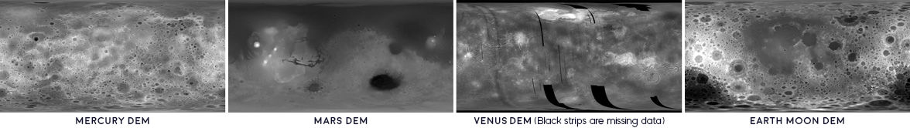

#### Map Projections
**A Quick Introduction:** Before we get into the details of map projection transformations, here's a quick overview of what this actually means. To map a 3D object in 2D space, the surface must be transformed using a map projection. There are many different projections, and for the maps in the *Atlas of Space* series I used Eckert IV, Orthographic, and Plate Carrée projections. To visually compare these different map projections, you can use a Tissot's indicatrix - a set of circles of the same size plotted at different places on the globe. All map projections distort space, but you can see that the effects are quite different depending on the projection:

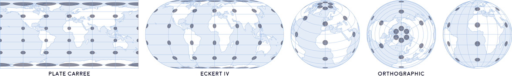

The choice of projection depends on the purpose of the map. For example, Eckert IV preserves area measurements, so I used Eckert IV in geologic maps to show how much area on the planet was made up of each geological formation. I used an Orthographic projection for these topographic maps to visualize what planets look like from outer space. And finally I used a Plate Carrée projection for constellation charts, because the perpendicular gridlines make it easy to read coordinates (which are essential for finding stars that rise and set throughout the night).

**Changing the Map Projection of a DEM File:** In this project I wanted to use an orthographic projection to show each hemisphere of the planet (North, South, East and West). However, the original DEM data file uses a Plate Carrée projection. To create a new orthographic map, I used the command line installation of `GDAL` - short for Geospatial Data Abstraction Library.

The code below, typed into a `bash` shell, uses the original `intif` file to create a new file `outtif` centered at a latitude of `90` degrees and longitude of `0` degrees in the `ortho` (orthographic) projection.

```bash
gdalwarp -t_srs "+proj=ortho +lat_0=90 +lon_0=0" ./path_to_intif.tif ./path_to_outtif.tif
```

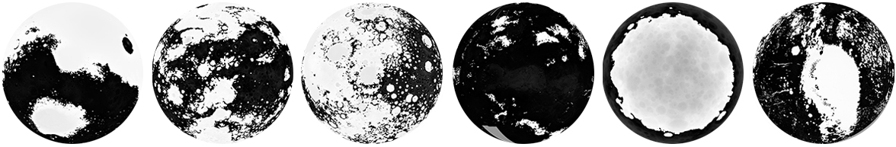

Next I downsample the DEM by decreasing the resolution of each pixel to `1500`x`1500` meters using the `average` method. It's useful to decrease file size to lower computation times, and it's much faster to downsample at this point than to scale images later on in the process.

```bash
gdalwarp -tr 1500 1500 -r average ./path_to_intif.tif ./path_to_outtif.tif
```

#### Hillshade and Slope
Next, I used the downsampled DEM to generate hillshade and slope maps for each hemisphere of the planet.

**Hillshade maps** show the shadows cast by a hypothetical light source suspended above the map. It’s hypothetical because in the real world, a single light source would cast different shadow angles at different places on a globe. The `GDAL` hillshade calculation sets the light source angle to be the same everywhere. In this hillshade I set `z`, or the vertical exaggeration, to 20. This multiplies the real elevation values by 20 to increase visual contrast and help the hillshade show up under all of the other map elements.

```bash
gdaldem hillshade -z 20 ./path_to_intif.tif ./path_to_hillshade.tif
```
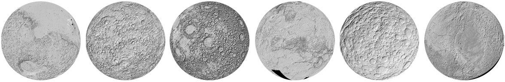

**Slope maps** emphasize the steep parts of a map, and adds more information to the topographic hillshade (which emphasizes absolute height rather than steepness).  

```bash
gdaldem slope ./path_to_intif.tif ./path_to_slope.tif
```
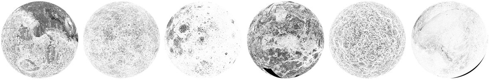

#### Automating Repetitive Tasks in Bash
Although these `GDAL` commands are fairly straightforward, some of them take a long time to run on my computer. I wanted to write a single script that would make all of my orthographic maps without having to sit and wait for each command to finish running.

The `bash` file `1_ortho_dem.sh` generates all four orthographic plots for Mars, Mercury, Venus, and the Moon, and then downsamples the data and creates hillshades and slopes for each projection. This `bash` script is a little more complex because you can specify the central longitude for the central map (for the Moon I decided to make maps of the near side and far side instead of the Eastern and Western hemispheres). I run `bash` scripts directly through my `bash` shell:

```bash
bash ./path_to/1_ortho_dem.sh
```

#### Additional notes about GDAL
It's worth noting that hillshades and slopes can also be generated in Python using the `osgeo` library. I haven't included this code because I'm less familiar with `osgeo`, but [this tutorial](https://geohackweek.github.io/raster/05-pygeotools_rainier/) may be helpful if you prefer pure Python. You can also customize hillshade and slope in many ways not mentioned here, as well as make other kinds of generated maps by [looking through the list of available GDAL commands](https://gdal.org/programs/gdaldem.html).

#### Planetary Nomenclature
The [International Astronomical Union](https://planetarynames.wr.usgs.gov/) is responsible for naming features of extraterrestrial objects. You can download a `CSV` file of all features from each planet from the IAU website (though the data for this project is already included in the `./data/planetary_features` folder).

To download nomenclature data, use the [Advanced Search Function](https://planetarynames.wr.usgs.gov/AdvancedSearch) and select `All Feature Types` from your `Target` of only an Approval Status of `Adopted by IAU`. In the `Columns to Include` section, select `Feature ID`, `Feature Name`, `Clean Feature Name`, `Target`, `Diameter`, `Center Lat/Lon`, `Feature Type`, and `Feature Type Code`. You can also include `Origin` if you'd like additional information about each feature, such as who it is named after. The `Output Format` should be `CSV`.

<a name="python"/>

## Map design in Python

Next, I made five Python plots with the contour fills, contour lines, text labels, and two types of gridlines. I often split up data for plotting so I can easily apply section-specific effects in Photoshop or Illustrator. The plotting code for all of these maps are shared in `2_plot_maps.ipynb`.

For this project I wanted all of my maps to fit nicely inside the decorative border I designed in Photoshop. To do this in Python, I use `matplotlib gridspec` to set up my figures so that each of my subplots occupy the exact pixel locations inside my decorative border.

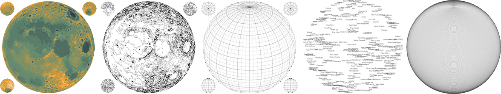

#### Smoothing and Filling in Data
There are two steps in this map where I smoothed or cleaned the original data. First, I needed to display the data at different scales for the smaller inset maps in the corners of the design. This is similar to what we see in apps like Google Maps: as you zoom out, the map removes smaller features like streets and buildings. Earth maps also use several different coastline shapes at different zoom levels.

Because I only had one `DEM` file, I made these coarser shapes myself by applying a Gaussian filter. Smoothing map data is a legibility step that's fairly subjective. The arrow in the diagram below shows the smoothing level I picked for my own Mercury maps, but other people might pick smoother or finer detail levels.

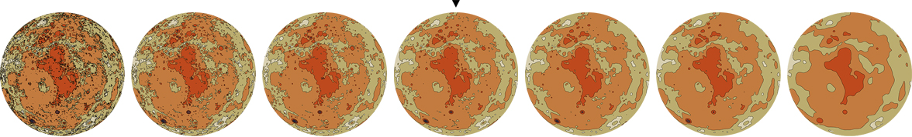

I also filled in missing pixels in the original data using the information in the surrounding pixels. Again, this is a data cleaning step that other people might implement differently. The `limit` and `limit_small` parameters in the configuration file describe the maximum sized hole that can be filled in (extremely large areas of missing data are left empty).

#### Configuration Files for Multiple Designs
Although the code is more or less the same for every map, I wanted to use different colors and input files for each planet. I organized all of these parameters inside the `config.json` configuration file. Configuration files are helpful because it's very easy to add or remove new planets - I could easily make a topographic map of Earth or Pluto by adding a new entry. The parameters include topographic levels, color, input files, and the amount of smoothing to apply to each map:

```javascript
"moon":{
    "cmap": ["#e6dfcf", "#ef9f30", "#638b71", "#24293c"],
    "levels": [-10000, 10000, 1000],
    "levels_small": [-20000, 20000, 5000],
    "file_large": "A:/ATLAS_OF_SPACE/image_outputs/ortho_DEMs/moon_lat30_lon0_downsampled.tif",
    "file_small": [ "A:/ATLAS_OF_SPACE/image_outputs/ortho_DEMs/moon_lat90_lon0_downsampled.tif",
                    "A:/ATLAS_OF_SPACE/image_outputs/ortho_DEMs/moon_lat-90_lon0_downsampled.tif",
                    "A:/ATLAS_OF_SPACE/image_outputs/ortho_DEMs/moon_lat0_lon180_downsampled.tif"],
    "save_head": "A:/ATLAS_OF_SPACE/image_outputs/topography/",
    "labelfile": "./data/planetary_features/moon.csv",
    "limit": 10,
    "limit_small": 10,
    "gauss": 10,
    "gauss_small": 30,
    "ortho": [0, 30]
  }
```

#### Planet Core Diagrams
For each planet I also wanted to make a cutaway diagram showing the interior layers. But when I started to plot this data, I ran into an issue where you couldn't actually see some of the layers because they were so thin. To solve this problem, I decided to use an adjusted visualization where every layer has a minimum visible thickness (I also added a disclaimer in the key that the figures were not to scale). This code is shared in `3_plot_cores.ipynb`.

In the diagram below, the left half shows the actual thickness of each layer, and the right half shows the adjusted version. For Mercury and the Moon there's actually no difference, but the effect is much stronger for the other planets with a very thin crust or atmosphere.

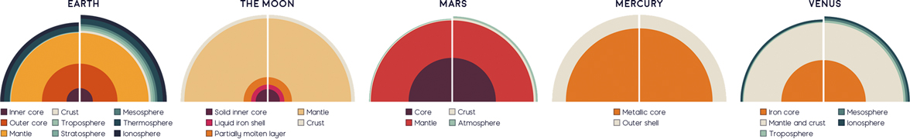

Each of the planet core diagrams also has a blurred image of the surface on the outside of the sphere. To make these I used the open-source stock images from [Stellarium](https://stellarium.org/), which I transformed from a Plate Carrée to an Orthographic projection in `3_plot_cores.ipynb`. I also intentionally blurred these images in Photoshop, because a more detailed surface illustration would take the focus away from the cutaway core diagram layers.

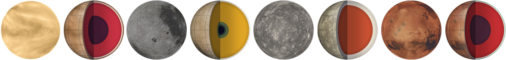

#### Saving Matplotlib figures

I usually save figures as a PDF so I can edit the text and shapes in Illustrator. There are a couple standard commands I use to export Matplotlib figures so they're easy to edit:

```python
import matplotlib
import matplotlib.pyplot as plt
import matplotlib.backends.backend_pdf as pdf

# Export text as editable text instead of shapes:
matplotlib.rcParams['pdf.fonttype'] = 42

# Preserve the vertical order of embedded images:
matplotlib.rcParams['image.composite_image'] = False

# Remove borders and ticks from subplots:
ax.axis('off')

# Remove padding and margins from the figure and all its subplots
plt.margins(0,0)
plt.subplots_adjust(top=1, bottom=0, right=1, left=0, hspace=0, wspace=0)
plt.gca().xaxis.set_major_locator(plt.NullLocator())
plt.gca().yaxis.set_major_locator(plt.NullLocator())

# Save the Matplotlib figure as a PDF file:
pp = pdf.PdfPages('./savename.pdf', keep_empty=False)
pp.savefig(fig)
pp.close()

# If I don't need to edit vector paths I save the file as a
# PNG so I can import it directly into Photoshop:
plt.savefig('./savename.png', format='png', dpi=600, pad_inches=0, transparent=True)
```

After saving the figure, the `PDF` file needs to be edited so that each object can be manipulated individually. In Illustrator,  select everything in the file and then go to `Object` --> `Clipping Mask` --> `Release`. At this point you can also delete the background and axis border objects, if you included them in the output file.

<a name="illustrator_photoshop"/>

## Map design in Illustrator and Photoshop

I export Python figures to Illustrator and Photoshop because several great design features are impossible or very time-consuming in Matplotlib. I'm linking tutorials here for the features I use most often - [font alternates](https://helpx.adobe.com/illustrator/using/special-characters.html) and [ligatures](https://helpx.adobe.com/illustrator/using/special-characters.html#use_ligatures_and_contextual_alternates), [custom brushes](https://helpx.adobe.com/illustrator/using/brushes.html), [layering effects](https://helpx.adobe.com/photoshop/using/layer-effects-styles.html), [blur effects](https://helpx.adobe.com/photoshop/using/blur-gallery.html), [gradients along a path](http://blog.gilbertconsulting.com/2017/06/using-gradients-on-strokes-in.html), [variable width paths](https://iamsteve.me/blog/entry/creating-custom-stroke-width-profiles-in-illustrator), [type on a path](https://helpx.adobe.com/illustrator/using/creating-type-path.html), and [selecting objects by characteristic](https://helpx.adobe.com/illustrator/using/selecting-objects.html#select_objects_by_characteristic).


#### Layering in Photoshop

I've included a small section of the map in the `figures` folder as the Photoshop file `topography_sample.psd`. The file is small enough to upload online, but since it still has the original layers you should be able to use it as a reference for layering effects.

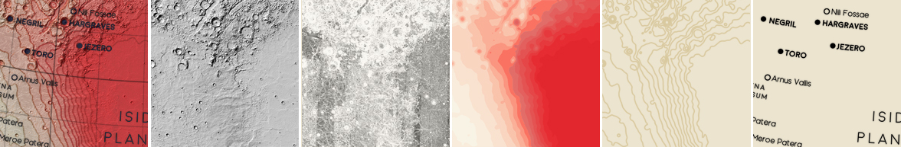

#### Text Annotation in Illustrator
I decided to annotate this map using text labels that followed the spherical contour lines of the planet. First I used Python to plot a series of latitude lines up and down the globe. I also made a Python output file that placed each text annotation next to a scatterpoint at the center of the feature. Finally I opened these files in Illustrator and manually combined each label with a nearby latitude line:
1. Use the `Type on a Path` tool to copy and paste the text for each object onto an appropriate latitude vector.
2. Use `Character` -> `Set the baseline shift` to center the text vertically to the desired location.

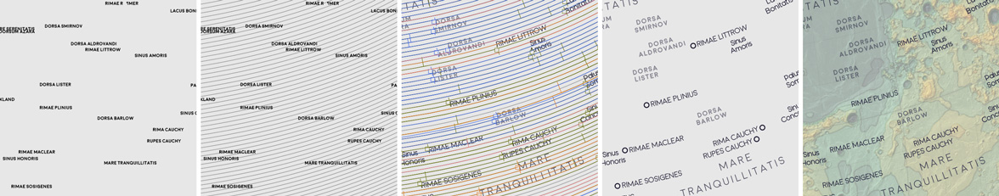

#### Shadows Underneath Text Labels in Photoshop

To create a shadow effect around the text labels, first save the text as a transparent `PNG` file and import it into Photoshop. Duplicate this annotation layer and go to `Filter` --> `Blur Gallery` --> `Field Blur`. For shadow text I usually create two blur layers set to 20% opacity - one with a `Blur` of 4px and the other 10px.

#### Color and Font

I wanted the maps in this series to look cohesive, so I made a palette of ~70 different colors and picked from these choices in every map. I also used the same two fonts ([Redflowers](https://creativemarket.com/TypeandStudio/923689-RedFlower-Typeface) and [Moon](https://harvatt.house/store/moon-font)) in all maps. You're welcome to use the color palette and font styling if you'd like.


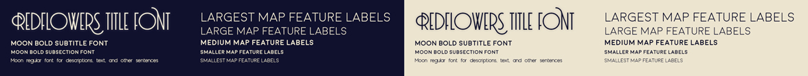

<a name="references"/>

## References
- [Astronomy](https://openstax.org/details/astronomy). Andrew Fraknoi, David Morrison, Sidney C. Wolff et al. OpenStax 2016.
- [Gazetteer of Planetary Nomenclature](https://planetarynames.wr.usgs.gov/). International Astronomical Union (IAU) Working Group for Planetary System Nomenclature (WGPSN) 2019.
- [LRO LOLA Elevation Model 118m (LDEM GDR)](https://astrogeology.usgs.gov/search/details/Moon/LRO/LOLA/Lunar_LRO_LOLA_Global_LDEM_118m_Mar2014/cub). NASA PDS and Derived Products Annex. LOLA Science Team 2018.
- [Mars HRSC MOLA Blended DEM Global 200m v2](https://astrogeology.usgs.gov/search/map/Mars/Topography/HRSC_MOLA_Blend/Mars_HRSC_MOLA_BlendDEM_Global_200mp_v2). NASA PDS and Derived Products Annex. USGS Astrogeology Science Center 2018.
- [Magellan Global Topography 4641m](https://astrogeology.usgs.gov/search/map/Venus/Magellan/RadarProperties/Venus_Magellan_Topography_Global_4641m). NASA PDS and Derived Products Annex. Magellan Team 2014.
- [Mercury MESSENGER Global DEM 665m (64ppd) v2 Oct. 2016](https://astrogeology.usgs.gov/search/map/Mercury/Topography/MESSENGER/Mercury_Messenger_USGS_DEM_Global_665m_v2). NASA PDS and Derived Products Annex. USGS Astrogeology Science Center 2016.
- [NASA Science Solar System Exploration](https://solarsystem.nasa.gov/). 2019.
- [Stellarium](https://stellarium.org/) 2019 version 0.19.0.
- **Fonts:** [Moon](https://harvatt.house/store/moon-font) by Jack Harvatt and [RedFlower](https://creativemarket.com/TypeandStudio/923689-RedFlower-Typeface) by Type & Studio.
- **Advice:** Thank you to Oliver Fraser, Henrik Hargitai, Jennifer Hsiao, Chloe Pursey, and Leah Willey for their helpful advice in making this map.

<a name="license"/>

## License

**Code:** All of the code in this repository is shared under the [GPL-3.0 license](https://www.gnu.org/licenses/gpl-3.0).

**Data:** The data in this repository belongs to the original authors of the data. Please use the references section to look up the original version. In cases where I edited or revised the data, I impose no additional restrictions to the original license. Any data files I created myself are shared under the [ODC Open Database License](https://opendatacommons.org/licenses/odbl/summary/).

**Artwork:** The artwork included in this repository are shared under a [Creative Commons Attribution-NonCommercial-NoDerivatives 4.0 International License](https://creativecommons.org/licenses/by-nc-nd/4.0/).
